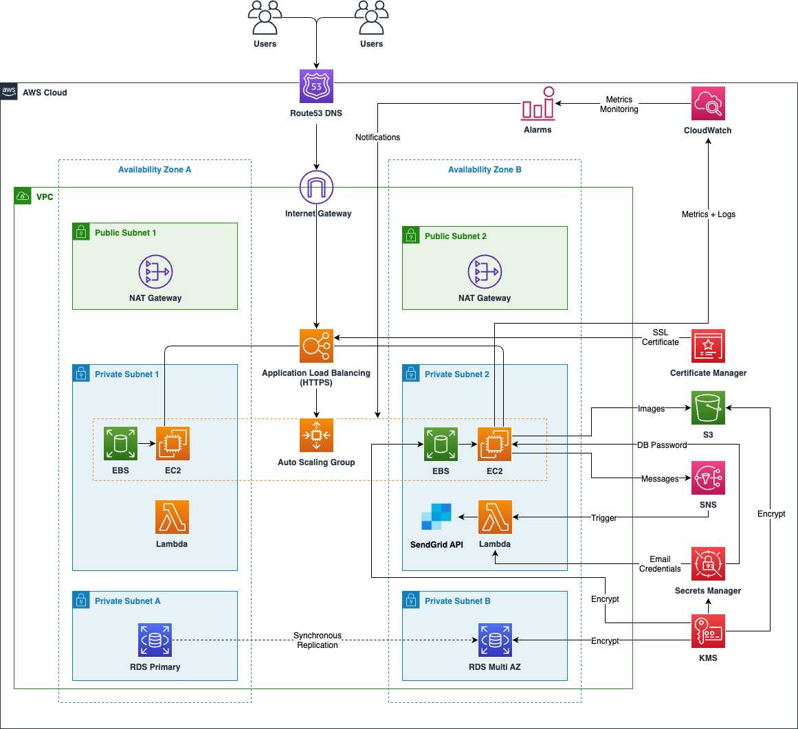
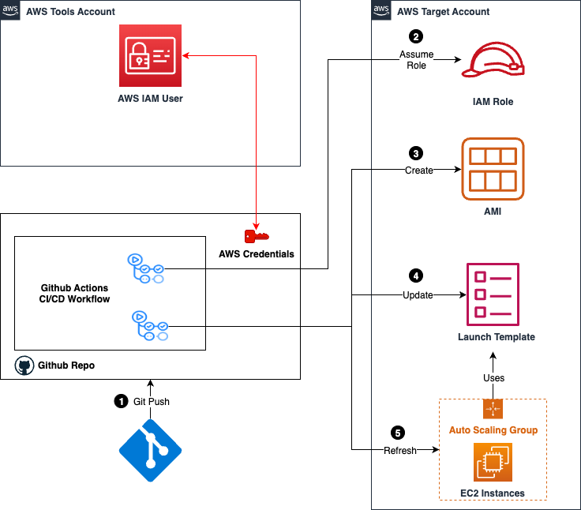

# Cloud User Management Service
A scalable user management application built with **Spring Boot** and deployed on **AWS**, designed to handle dynamic traffic, ensure high availability, secure sensitive data and streamline CI/CD.

## Summary
- **Backend**: Developed with Spring Boot, secured with Spring Security, and integrated with MySQL for data storage and S3 for user image.
- **Infrastructure as Code**: Automated AWS resource provisioning using Terraform.
- **Scalable Deployment**: EC2 instances deployed behind an Application Load Balancer (ALB), with Auto Scaling Groups (ASG) to manage dynamic traffic.
- **Serverless Features**: Integrated AWS SNS, Lambda, and SendGrid for password verification workflows.
- **Secrets Management**: Utilized AWS KMS for securely encrypting and managing sensitive credentials, including RDS passwords, API keys.
- **SSL Integration**: Purchased and activated an SSL certificate via Namecheap, imported to AWS ACM, and configured for secure HTTPS connections.
- **Domain Integration**: Configured Route53 for custom domain mapping, enabling users to access the application via a friendly URL.
- **CI/CD**: Automated CI/CD pipeline with GitHub Actions which leverage Packer to build custom AMIs, run tests, update Auto Scaling Group configurations, and ensure seamless deployment upon merging to the main branch.

## Architecture

## Tools and Technologies

| **Category**         | **Tools & Services**                          |
|-----------------------|-----------------------------------------------|
| **Infrastructure**    | VPC, ALB, ASG, EC2, Route53, RDS, S3, Terraform, Packer |
| **Backend**           | Spring Boot, Spring Security, MySQL, Maven              |
| **Secrets Management**           | AWS KMS for encrypting RDS passwords, API keys, and other sensitive credentials           |
| **SSL Certificates**           | Namecheap (purchase and activation), ACM for management and ALB integration             |
| **CI/CD**             | GitHub Actions, AWS CLI                      |
| **Monitoring & Alerts** | StatsD, CloudWatch                    |
| **Serverless**        | AWS Lambda, SNS, SendGrid                    |

## Features
### 0. Pre-Requisites
- Install **Postman** for API testing.
- Configure AWS CLI profiles for **dev** and **demo** accounts:
  1. Generate IAM access keys for admin users.
  2. Store keys securely in your local machine.

### 1. Infrastructure Setup
- Automated creation of **VPC**, **Subnets**, and **Route53** configurations using **Terraform**.
- Provisioned **RDS**, **ALB**, **S3**, and **SNS** for scalable and secure application deployment.
- Configured custom **IAM Policies** and **security groups** for resource-specific access, ensuring security.
- Mapped application access to a custom domain using **Route53**, allowing users to interact with the application via a user-friendly URL (e.g., `https://<your domain name>/api`).

### 2. Web Application
- Developed a **RESTful API** with **Spring Boot** for user management.
- Secured the API with **Spring Security** using Basic Authentication.
- Implemented **image upload** functionality to **S3**.
- Used **KMS** to encrypt the **RDS password**, **SendGrid API keys**, and sensitive application configurations.

### 3. SSL Integration
- SSL Purchase: An SSL certificate was purchased from Namecheap.
- Activation: The certificate was activated by generating a CSR (Certificate Signing Request) from AWS.
- Integration:
  - Imported the SSL certificate into AWS ACM for management.
  - Configured ALB to use the certificate for HTTPS connections.
  - Ensured SSL termination at the ALB for secure traffic routing.

### 3. Domain Setup
- Registered and managed the domain through **Route53 DNS**.
- Configured **A records** and **CNAME records** for domain routing.
- Linked the domain to the **ALB** to ensure proper traffic distribution and SSL termination.

### 4. Configuring Domain in SendGrid
- Generate DNS Records under "Authenticate Your Domain" of SendGrid: Choose Amazon Route 53 as DNS provider, enter your domain, and generate the CNAME records for SPF and DKIM authentication.
- Add Records to Route 53: Add the CNAME records provided by SendGrid to your DNS configuration in AWS console.
  
### 5. Secrets Management
- KMS Encryption:
Encrypted RDS database passwords, SendGrid API keys, and other sensitive configurations using AWS KMS.
- Usage in EC2 and Lambda:
Secrets are retrieved and decrypted by EC2 instances and Lambda functions during runtime.

### 6. Serverless Password Verification
- Created a **pub/sub system** using **AWS SNS** and **Lambda** for user registration:
  1. Password reset requests trigger a message to the SNS topic.
  2. Lambda sends verification emails using **SendGrid** to user email (within 2 minutes to verify).

### 7. CI/CD Workflow

- Configured **GitHub Actions** to automate the entire CI/CD process:
  1. Configure access keys and IDs for both dev and demo accounts with unique names for the GitHub Actions secrets.
  2. Raise a pull request in the git repository which triggers the github workflows. The workflows do the following things:
    - Run unit tests using **JUnit** and **Mockito**.
    - Validate **Packer templates**
  3.  When the pull request is merged, the workflow performs the following:
    - Build **AMIs** with application dependencies using packer.
    - Update launch templates for **Auto Scaling Groups** with the latest AMIs.
    - Refresh EC2 instances using the latest configuration.

### 8. Monitoring and Alerts
- Integrated **StatsD** to track application metrics.
- Configured **CloudWatch Alarms** to monitor usage and dynamically scale EC2 instances.

